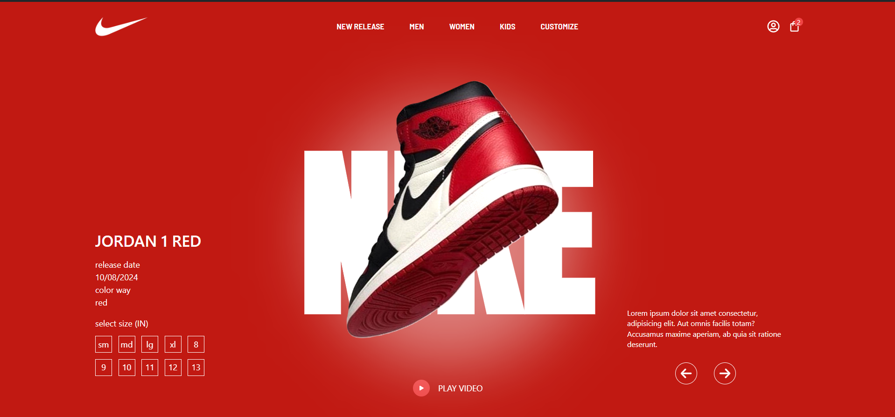

# Nike Shoe Landing Page

## Project Overview

This project is a dynamic and visually appealing landing page for Nike shoes. Built with modern web development technologies, it showcases a seamless user experience with smooth animations and a responsive design.

## Tech Stack

- **ReactJS**: A JavaScript library for building user interfaces.
- **Tailwind CSS**: A utility-first CSS framework for rapid UI development.
- **Framer-motion**: A library for creating animations and gestures in React.

## Features

- **Responsive Design**: Ensures a seamless experience across all devices.
- **Smooth Animations**: Engages users with interactive and fluid animations.
- **Clean UI**: A modern and clean user interface that highlights Nike shoes.

## Installation

1. **Clone the repository**:
   ```bash
   git clone https://github.com/yourusername/nike-shoe-landing-page.git
